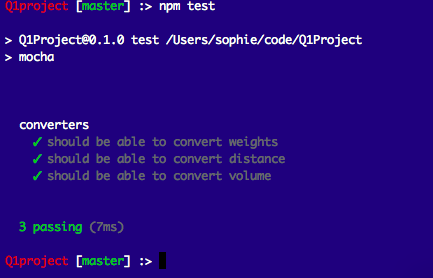

# Q1 Project

## Installation

Basic Idea: Simply run `npm install`. Afterwards, tests can be run with `npm test`.

## A screenshot of website page that I am testing!

## 1) Proper Folder

It is really important that you are in the right folder in the terminal for the task below to work. For example, if the folder is called Q1 project, it should say Q1project in red writing following a bracket ([*****]). 

## 2) Download npm Packages
This repository contains a test suite. You'll need to navigate to the cloned folder and type the following command:

npm install
You may see some warnings during this process, it's safe to ignore these particular warnings.

## 3) Run Tests
After all packages have been downloaded, type the following command to run your tests:

npm test

 

If this works: you should see something similar to this picture. 

☺

 